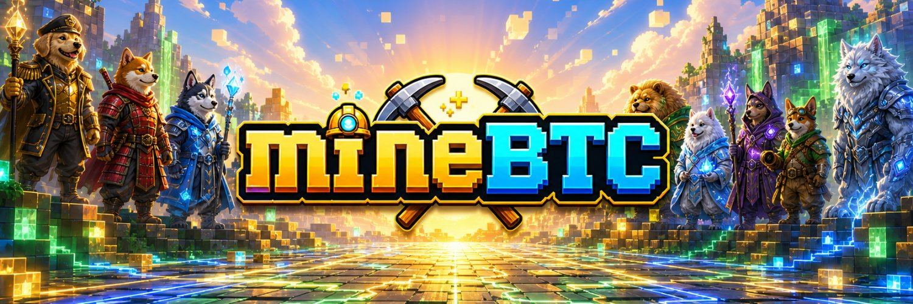

<p align="center">
  <a href="https://hashiden.tv/">
    
  </a>
</p>

<h1 align="center">HASHIDEN — AI Content Engine</h1>

<p align="center">
  <strong>The open-source studio behind HASHIDEN (ハシデン) — the 24/7 show written by gameplay.</strong><br>
  Every 4 hours of the country war becomes a chapter. 42 chapters make a season. The players own the cast.
</p>

<p align="center">
  <a href="https://hashiden.tv/">Play Hashiden</a>
  ·
  <!-- TODO(handle-unclaimed): point at the verified X handle once claimed -->
  <a href="https://hashiden.tv/">hashiden.tv</a>
  ·
  <a href="SHOW_BIBLE.md">Show Bible</a>
  ·
  <a href="WORLD_BIBLE.md">World Bible</a>
  ·
  <a href="trailer/README.md">Trailer Pipeline</a>
  ·
  <a href="CONTRIBUTING.md">Contribute</a>
</p>

[](https://github.com/LifeOrDream/hashiden-content-engine/actions/workflows/ci.yml)
[](LICENSE)
[](package.json)

## What Is HASHIDEN?

HASHIDEN is a serialized show produced by gameplay, not by a writers' room.

[Hashiden](https://hashiden.tv/) is a country-vs-country mining war on Solana: twelve nations of dog-warrior HashBeasts race to out-mine each other. Every 4-hour war cycle settles on chain, and the engine in this repo turns that settled cycle into a chapter — cover, recap, cast, ledger, cliffhanger. 42 chapters make a weekly season. The show never stops because the game never stops.

### The World Model, at engine altitude

This engine is the rendering half of Hashiden's **World Model**: it takes a stream of settled on-chain events and renders them into canon-constrained story. The constraint is the **world bible** (`src/world/bible.ts`) — the Council of Twelve, the rivalry map, the style ladder, the ceremony language — and it is **public and open source**, right here in this repo, alongside the grammar checks that keep generations on-canon.

What is deliberately *not* here is everything that couples to live play: the accumulated story corpus, the per-character genome cards, the preference signals that steer what gets rendered, wallets, and game state. The engine reads none of it. Every job is a self-contained snapshot in, a bounded creative artifact out — so the studio is inspectable and reusable without exposing the game it renders. **You can fork the engine; the corpus and canon are trained elsewhere.**

Three things make it different from any show before it:

- **The players own the cast.** The characters are HashBeasts — a genesis run of 36,000 player-owned characters with breed, country, gear, powers, and a story state that compounds across chapters.
- **The players write themselves in.** Direct-Your-Beast lets owners author their character's personality sheet; the engine renders it into canon-adjacent lore. On-chain events are canon; owner lore is apocrypha; every claim cites its cycle, clip, and transaction.
- **The show is produced BY the game, not about it.** Wins, mutations, evolutions, mints, and rivalries are the plot. Minting a beast is a character intro. A claim streak is an arc.

## The Theme: Climbing The Kardashev Scale

The show's premise is humanity's first climb up the Kardashev scale — a civilization measuring itself by the power it can harness instead of the territory it can hold. The twelve countries compete to fund the ascent. The rockets get the headlines; the dogs dig the fuel.

The fourth wall is the scale itself. The show's compute is bought with the game's own fees, so the compute ledger printed in every chapter is the series' Kardashev meter: the more the war is played, the more compute burns, the richer the show renders. The fee writes the film. The show's budget is its plot.

Tonally: optimism is the spine, conflict is the muscle. The full dramatic palette is in play — greed, underdogs, secrets, thrillers, real engineering — but every arc bends toward "we go up." Villains are greed and smallness, never nations; every country is a key player.

- [`SHOW_BIBLE.md`](SHOW_BIBLE.md) is the creative constitution: what the show is for, the tonal contract, the season spine.
- [`WORLD_BIBLE.md`](WORLD_BIBLE.md) is the canon roster: the Council of Twelve, lieutenants, rivalry map, style ladder, and editing rules. The typed version every pipeline imports is `src/world/bible.ts`.

## What This Repo Does

This repo is the studio: the creative layer that turns game state into a consistent media universe instead of disconnected AI clips.

- **World bible + progression grammar** (`src/world/`): the typed canon — 12-country roster, rivalry map, palettes, voices, the 3-rung style ladder, and the 8-stage growth ladder (Pup → Ascended) with one named ceremony per transition (The First Spark, The Scar Ceremony, The Ascension…).
- **Emotional moment grammar + rivalry dialogue** (`src/nft-pipeline/moments.ts`, `momentContent.ts`): game events become staged emotional beats with performance bands per stage and rivalry-aware dialogue stings.
- **Beast memory, epithets, technique debuts** (`src/nft-pipeline/beastMemory.ts`): per-beast story memory that compounds across cycles — milestone-minted epithets, first-use records for named techniques, per-rival win/loss ledgers.
- **Chapter generation** (`src/content-engine/chapterWriter.ts`, `chapter.write` / `chapter.canonize` jobs): one settled war cycle in, one chapter anatomy out — cover (title + text-free cover-art prompt on the winning country's location), recap beats that pay off the previous cliffhanger, cast of the chapter, compute ledger, and a persisted cliffhanger the next chapter must answer.
- **Chapter → video + replay/compare** (`src/service/chapterVideo.ts`, `chapter.produce` job; CLIs `chapter:produce` / `chapter:replay`; WebUI `/chapters`): turn a settled cycle's facts into a rendered episode video end-to-end — chapter anatomy → a synthesized blueprint → the trailer pipeline → `final.mp4`. Every production is archived and **versioned** so a past chapter can be **re-run after code changes** and compared old-vs-new side by side (full re-render, or render-only A/B with the script frozen), optionally billed to your own fal.ai key.
- **NFT asset pipeline** (`nft.*` jobs): DNA-driven mint art with a Gemini identity gate and bounded regens, chroma-strip state loops assembled into transparent APNGs (mining/win/lose), mutation ceremonies with transition clips and voiced lines, and per-beast cycle recap MP4s. See [docs/nft-pipeline.md](docs/nft-pipeline.md).
- **Casino rituals** (`src/nft-pipeline/ritual.ts`): lootbox reveals and claim rolls staged as rituals, not toasts — drawing on a canonical rarity light language so a Motherlode glow reads identically on every surface. See [docs/rituals-and-audio.md](docs/rituals-and-audio.md).
- **Audio identity** (`src/world/audioIdentity.ts`): the ownable sound spec — fanfare tiers mapped to rarity, cue ids every ritual and ceremony pulls from.
- **Trailer pipeline + reels** (`trailer/`, `produce_reel` job): multi-pass screenplay writing, dialogue refinement, frame planning, multi-scene video generation, lip-sync, subtitles, and assembly — exposed both as a local WebUI and as a `produce_reel` service job the backend can dispatch.
- **Service mode** (`src/service/`): a Redis/BullMQ worker so the game backend dispatches content jobs over a queue instead of importing this repo as backend code.

## Production vs Reference

Honesty about what runs where:

- **Running in production for Hashiden:** the service worker and its job surface — `nft.*` asset jobs (mint art, state loops, mutation content, cycle summaries), ritual jobs, chapter writing/canonization (`chapter.*`), chapter-video + reel rendering (`chapter.produce`, `produce_reel`), and the creative prompt jobs. The Hashiden backend owns budgets, persistence, and posting; this engine owns the creative + media work. (The backend's `CONTENT_VIA_ENGINE` cutover routes its in-process NFT media generation onto these jobs.)
- **Operated locally by the team:** the trailer pipeline + WebUI (script/render launch trailers and show keyframes) and the **chapter replay/compare** console (`/chapters`), used to re-run a past chapter under new code and verify the video/script actually improved.
- **Reference implementation:** the world-pack and provider-adapter layers. Hashiden is the first world; the structure is built so another game can swap in its own canon, events, and providers, but no second world ships in this repo yet.

Direct-Your-Beast and the full chapter-page product roll out in phases on the Hashiden side; the engine contracts for them (beast memory snapshots, chapter anatomy, mint intros) are in this repo today.

## How The Pipeline Works

```mermaid
flowchart LR
  A["Hashiden game / NFT events"] --> B["Backend adapter"]
  B --> C["Redis / BullMQ queue"]
  C --> D["Content engine worker"]
  D --> E["Story planner"]
  E --> F["Character canon + story memory"]
  F --> G["Screenplay + dialogue"]
  G --> H["Keyframe prompt packet"]
  H --> I["Image / video / voice adapters"]
  I --> J["Draft clip + media proof"]
  J --> K["Human approval"]
  K --> L["Posted video / chapter"]
  L --> M["Canonized story memory"]
  M --> G
```



Production boundary:

- Hashiden backend owns game state, DB reads/writes, wallet/user context, budget gates, persistence, and posting.
- This content engine owns story planning, prompt grammar, screenplay/script generation, keyframe prompt generation, chapter writing, trailer tooling, and media-generation helpers.
- The service queue defaults to `hashiden-content-engine`.

## Why Open Source The Studio?

The studio is a public good. The pattern here — game event → character canon → story memory → script → media → proof → canon update — is not specific to Hashiden. Any game with events, characters, and an economy can adapt it to produce its own show.

And consistent AI media is not solved by one big prompt. It needs a system:

- Canon so characters do not drift.
- Story memory so clips compound instead of resetting.
- Prompt packets so outputs can be reviewed and reproduced.
- Reference assets so models stay on-brand.
- Quality scorecards so contributors can improve the pipeline with evidence.
- Adapters so the same story logic works across image, video, voice, and music models.

We want contributors to make HASHIDEN better while making a reusable content-engine pattern for other game worlds.

## Portable By Design

To adapt the engine for another game, replace the world pack:

- Characters instead of HashBeasts.
- Factions/guilds/teams instead of Hashiden countries.
- Your own visual bible, camera grammar, and negative prompts.
- Your own event types: mint, evolve, battle, trade, quest, raid, win, loss, betrayal, alliance.
- Your own provider adapters for image, video, voice, music, storage, and delivery.

The core goal stays the same: generated content that feels like it comes from a living world with consistent characters. See [docs/world-packs.md](docs/world-packs.md).

## Quick Start

Runtime: Node 22+ recommended.

```bash
npm install
npm run typecheck
npm run demo:fixture
```

`npm run demo:fixture` uses local fake Hashiden state only. It does not call FAL, Gemini, AWS, Telegram, Redis, or the Hashiden backend.

## Common Commands

```bash
# Verify TypeScript
npm run typecheck

# Run a no-key contributor demo
npm run demo:fixture

# Open the local Next.js generation WebUI
npm run webui

# Run the Redis/BullMQ content-engine worker used by the Hashiden backend
npm run service:worker

# Generate / iterate script passes for trailer 01
npm run trailer:script -- 01

# Render the final trailer from trailer/out/<id>/scenes.json
npm run trailer:generate -- 01

# Canonize a posted video into story memory
npm run trailer:canonize -- 01 --platform x --url https://x.com/... --video-no 1
```

## Local WebUI

The repo includes a local Next.js dashboard for operating the trailer pipeline:

```bash
npm run webui
```

Open [http://127.0.0.1:8787](http://127.0.0.1:8787). The WebUI reads the real repo artifacts and lets you:

- Start `npm run trailer:script` jobs by blueprint, range, or single pass.
- Start `npm run trailer:generate` render jobs by sequence, range, or full trailer.
- Track persisted job logs without digging through terminals.
- Inspect every pass file in `trailer/out/<id>/`.
- Review `scenes.json`, generated videos, generated frames, subtitles, frame reference health, and dialogue QA.
- Inspect `run-manifest.json`: stage timeline, rough cost estimate, reference assets, generated artifacts, and FAL request IDs.
- Catch bad dialogue early: tiny slogan lines, prop-label dialogue, mechanic words in mouths, and timing mismatch.

The WebUI is local-first and binds to `127.0.0.1` through its package script. It does not expose secrets; it only reads approved trailer artifacts and whitelisted Hashiden banner assets.

Local service mode needs Redis or Valkey:

```bash
docker run -d -p 6379:6379 --name valkey valkey/valkey:alpine
npm run service:worker
```

## Folder Map

```text
src/world/                Typed canon: world bible, 8-stage progression grammar, base types, audio identity.
src/content-engine/       Creative primitives: prompt grammar, chapter writer, screenplay normalization, dialogue QA.
src/nft-pipeline/         NFT asset pipeline: mint art, state-loop APNGs, mutation ceremonies, rituals, beast memory, cycle recaps.
src/prompts/              HashBeast prompt grammar: world lore, 12 faction packs, breeds, trait resolution.
src/service/              Redis/BullMQ worker contracts and job processor.
src/utils/                Media/provider helpers, incl. the multi-scene video primitive.
scripts/                  Contributor scripts incl. assemble_anim.py (chroma-strip → APNG assembler).
trailer/blueprints/       Launch trailer rough story clay and series blueprints.
trailer/pipeline/         Multi-pass screenplay/script compiler.
trailer/generate/         Frame, video, audio, lip-sync, and assembly pipeline.
trailer/world/            Country cast, location registry, and canon story memory.
trailer/reference/        HashBeast character and environment reference boards.
docs/                     Contributor docs, architecture, story engine, proof, world packs, adapters.
.github/                  Issue templates, PR template, labels, CI, and ownership.
```

## Documentation

- [Show Bible](SHOW_BIBLE.md) — the creative constitution
- [World Bible](WORLD_BIBLE.md) — the canon roster and editing rules
- [Architecture](docs/architecture.md)
- [Story Engine](docs/story-engine.md) — beast memory, mint intros, Hashiden chapters
- [NFT Asset Pipeline](docs/nft-pipeline.md)
- [Base Types](docs/base-types.md)
- [Casino Rituals + Audio Identity](docs/rituals-and-audio.md)
- [Multi-Scene Video](docs/video-scenes.md)
- [Media Proof and Evals](docs/evals-and-media-proof.md)
- [World Packs](docs/world-packs.md)
- [Provider Adapters](docs/provider-adapters.md)
- [Trailer Pipeline](trailer/README.md)
- [Contributor Playbook](CONTRIBUTING.md)
- [Labels](docs/labels.md)
- [Security](SECURITY.md)

## How To Contribute

Start with issues labeled `good first issue`, `area: prompts`, `area: evals`, `area: world-pack`, or `proof: needed`.

High-impact contribution examples:

- Improve HashBeast dialogue so characters sound like a bingeable show, not ad copy.
- Improve keyframe prompts so attached character references stay consistent.
- Add world-pack details for countries, breeds, environments, and faction rivalries.
- Add evals that catch identity drift, generic crypto visuals, weak hooks, bad lip-sync, or muddy video.
- Add provider adapters for better image, video, voice, music, storage, or review workflows.

For prompt/video changes, PRs should include media proof:

- What behavior you improved.
- Exact command or generation path.
- Prompt packet or changed fixture.
- Before/after frame or clip if available.
- Quality scorecard: character consistency, brand fit, dialogue, motion, lip-sync, pacing, artifacts.
- What you did not test.

See [CONTRIBUTING.md](CONTRIBUTING.md) for the full process.

## Environment

Copy `.env.example` only when you need live generation:

```bash
cp .env.example .env
```

Never commit `.env`, generated videos, provider keys, Telegram tokens, AWS keys, or private production outputs.

## Work With Me

I build **Solana & AI products end-to-end** — AI content pipelines like this one, on-chain programs, full-stack dApps, and real-time game systems.

**Available for freelance / contract work.** Want your Solana or AI project built? Reach out on Telegram — **[@Sunshine_Rider](https://t.me/Sunshine_Rider)**.

## License

MIT. See [LICENSE](LICENSE).
