<p align="center">
  <a href="https://www.minebtc.fun/">
    
  </a>
</p>

<h1 align="center">MineBTC AI Content Engine</h1>

<p align="center">
  <strong>The open-source content pipeline behind MineBTC HashBeasts.</strong><br>
  Game events become character canon, scripts, keyframes, trailers, and social video proof.
</p>

<p align="center">
  <a href="https://www.minebtc.fun/">Play MineBTC</a>
  ·
  <a href="https://x.com/minebtcdotfun">X / Twitter</a>
  ·
  <a href="trailer/README.md">Trailer Pipeline</a>
  ·
  <a href="CONTRIBUTING.md">Contribute</a>
</p>

[](https://github.com/LifeOrDream/ai-content-engine/actions/workflows/ci.yml)
[](LICENSE)
[](package.json)

## What Is MineBTC?

[MineBTC](https://www.minebtc.fun/) is a country-vs-country mining game on Solana.

Players pick a country, play the mining race, and collect/evolve HashBeasts: stylized dog-warrior operators with breed, country, role, gear, powers, personality, and story state. The game world is built around degenBTC: a mined token whose economy, emissions, rewards, and faction race create constant live events.

The important content idea is simple:

> HashBeasts are not static NFTs. They are recurring characters in a living show produced by gameplay.

When HashBeasts mint, evolve, mutate, win rounds, lose status, unlock powers, or get pulled into country rivalries, those game events can become trailers, reels, faction propaganda, comedy beats, cliffhangers, and social posts. The content engine is how we turn game state into a consistent media universe instead of random AI clips.

## What This Repo Is

This repo is the open-source MineBTC HashBeasts content pipeline.

It handles the creative layer:

- Character canon: breed, faction, visual identity, owner/profile context, voice, personality, recent story.
- Story memory: active arcs, unresolved threads, posted videos, character last-seen state.
- Prompt grammar: director rules, camera/motion rules, negative prompts, model-safe style constraints.
- Script pipeline: multi-pass trailer writing, dialogue refinement, scene direction, and frame planning.
- Media generation: keyframe prompts, image/video/voice/lip-sync adapters, proof artifacts, and review loops.
- Service mode: Redis/BullMQ worker so the game backend can send content jobs without importing this repo as local backend code.

MineBTC is the reference implementation, but the structure is intentionally portable. Any game with characters, events, factions, story state, and media outputs should be able to adapt the same pattern.

## Why Open Source This?

AI video quality is not solved by one big prompt. It needs a system:

- Canon so characters do not drift.
- Story memory so clips compound instead of resetting.
- Prompt packets so outputs can be reviewed and reproduced.
- Reference assets so models stay on-brand.
- Quality scorecards so contributors can improve the pipeline with evidence.
- Adapters so the same story logic can work across different image, video, voice, and music models.

We want contributors to help make the HashBeasts show better while also making a reusable content-engine pattern for other game worlds.

## How The Pipeline Works

```mermaid
flowchart LR
  A["MineBTC game / NFT events"] --> B["Backend adapter"]
  B --> C["Redis / BullMQ queue"]
  C --> D["Content engine worker"]
  D --> E["Story planner"]
  E --> F["Character canon + story memory"]
  F --> G["Screenplay + dialogue"]
  G --> H["Keyframe prompt packet"]
  H --> I["Image / video / voice adapters"]
  I --> J["Draft clip + media proof"]
  J --> K["Human approval"]
  K --> L["Posted video"]
  L --> M["Canonized story memory"]
  M --> G
```



Production boundary:

- MineBTC backend owns game state, DB reads/writes, wallet/user context, budget gates, persistence, and posting.
- This content engine owns story planning, prompt grammar, screenplay/script generation, keyframe prompt generation, trailer tooling, and media-generation helpers.
- The service queue defaults to `minebtc-content-engine`.

## Portable By Design

This is not meant to be only a MineBTC private script folder. The reusable pattern is:

```text
game event -> character canon -> story memory -> script -> keyframe -> video -> proof -> canon update
```

To adapt it for another game, replace the world pack:

- Characters instead of HashBeasts.
- Factions/countries/guilds/teams instead of MineBTC countries.
- Your own visual bible, camera grammar, and negative prompts.
- Your own event types: mint, evolve, battle, trade, quest, raid, win, loss, betrayal, alliance.
- Your own provider adapters for image, video, voice, music, storage, and delivery.

The core goal stays the same: make generated content feel like it comes from a living world with consistent characters.

## Quick Start

Runtime: Node 22+ recommended.

```bash
npm install
npm run typecheck
npm run demo:fixture
```

`npm run demo:fixture` uses local fake MineBTC state only. It does not call FAL, Gemini, AWS, Telegram, Redis, or the MineBTC backend.

## Common Commands

```bash
# Verify TypeScript
npm run typecheck

# Run a no-key contributor demo
npm run demo:fixture

# Open the local Next.js generation WebUI
npm run webui

# Run the Redis/BullMQ content-engine worker used by MineBtcBackend
npm run service:worker

# Generate / iterate script passes for trailer 01
npm run trailer:script -- 01

# Render the final trailer from trailer/out/<id>/scenes.json
npm run trailer:generate -- 01

# Canonize a posted video into story memory
npm run trailer:canonize -- 01 --platform x --url https://x.com/... --video-no 1
```

## Local WebUI

The repo includes a local Next.js dashboard for operating the trailer pipeline:

```bash
npm run webui
```

Open [http://127.0.0.1:8787](http://127.0.0.1:8787). The WebUI reads the real repo artifacts and lets you:

- Start `npm run trailer:script` jobs by blueprint, range, or single pass.
- Track running jobs and logs without digging through terminals.
- Inspect every pass file in `trailer/out/<id>/`.
- Review `scenes.json`, generated videos, frame reference health, and dialogue QA.
- Catch bad dialogue early: tiny slogan lines, prop-label dialogue, mechanic words in mouths, and timing mismatch.

The WebUI is local-first and binds to `127.0.0.1` through its package script. It does not expose secrets; it only reads approved trailer artifacts and whitelisted MineBTC banner assets.

Local service mode needs Redis or Valkey:

```bash
docker run -d -p 6379:6379 --name valkey valkey/valkey:alpine
npm run service:worker
```

## Folder Map

```text
src/content-engine/       Pure creative primitives: prompt grammar, fixtures, screenplay normalization.
src/service/              Redis/BullMQ worker contracts and job processor.
src/utils/                Media/provider helpers used by local trailer generation.
trailer/blueprints/       Launch trailer rough story clay and series bible.
trailer/pipeline/         Multi-pass screenplay/script compiler.
trailer/generate/         Frame, video, audio, lip-sync, and assembly pipeline.
trailer/world/            Country cast, location registry, and canon story memory.
trailer/reference/        HashBeast character and environment reference boards.
docs/                     Contributor docs, architecture, proof, world packs, adapters.
.github/                  Issue templates, PR template, labels, CI, and ownership.
```

## Documentation

- [Architecture](docs/architecture.md)
- [Contributor Playbook](CONTRIBUTING.md)
- [Media Proof and Evals](docs/evals-and-media-proof.md)
- [Provider Adapters](docs/provider-adapters.md)
- [World Packs](docs/world-packs.md)
- [Trailer Pipeline](trailer/README.md)
- [Labels](docs/labels.md)
- [Security](SECURITY.md)

## How To Contribute

Start with issues labeled `good first issue`, `area: prompts`, `area: evals`, `area: world-pack`, or `proof: needed`.

High-impact contribution examples:

- Improve HashBeast dialogue so characters sound like a bingeable show, not ad copy.
- Improve keyframe prompts so attached character references stay consistent.
- Add world-pack details for countries, breeds, environments, and faction rivalries.
- Add evals that catch identity drift, generic crypto visuals, weak hooks, bad lip-sync, or muddy video.
- Add provider adapters for better image, video, voice, music, storage, or review workflows.

For prompt/video changes, PRs should include media proof:

- What behavior you improved.
- Exact command or generation path.
- Prompt packet or changed fixture.
- Before/after frame or clip if available.
- Quality scorecard: character consistency, brand fit, dialogue, motion, lip-sync, pacing, artifacts.
- What you did not test.

See [CONTRIBUTING.md](CONTRIBUTING.md) for the full process.

## Environment

Copy `.env.example` only when you need live generation:

```bash
cp .env.example .env
```

Never commit `.env`, generated videos, provider keys, Telegram tokens, AWS keys, or private production outputs.

## License

MIT. See [LICENSE](LICENSE).
