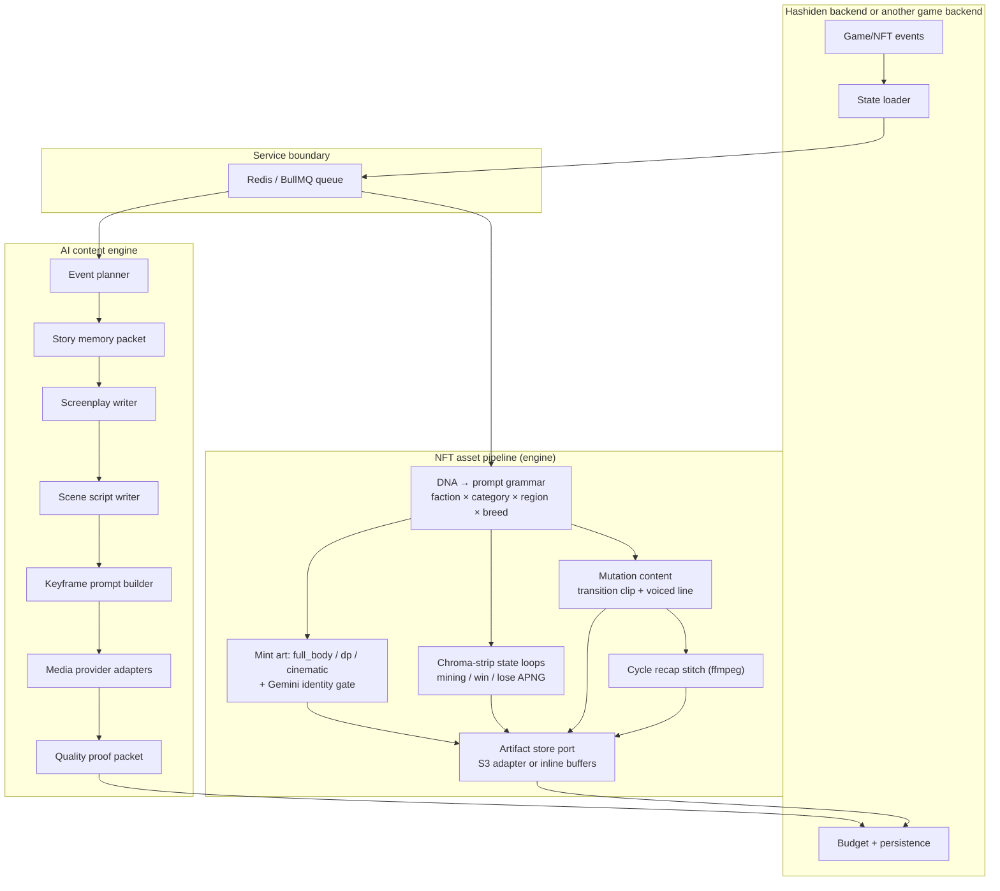

# Architecture

The engine is split into a reusable creative core and runtime adapters.

## Runtime Shape



## Boundaries

Backend responsibilities:

- Load live game/NFT/user/economy state.
- Decide budgets, rate limits, and posting windows (the economics gate runs BEFORE a job is enqueued).
- Persist draft and canon content (DB rows, asset URLs, NFT metadata JSON, CDN invalidation).
- Trigger the engine over Redis/BullMQ, with idempotent job ids.
- Emit sockets/Telegram/socials from engine results and progress events.
- Own per-cycle memory (which clips belong to a war cycle) and voice-id durability.
- Own private infrastructure and production secrets.

Content engine responsibilities:

- Convert events into story beats.
- Build character canon and prompt blocks.
- Write screenplays, scene scripts, frame plans, and motion prompts.
- Track reusable world-pack and trailer definitions.
- Produce prompt packets and proof metadata for generated media.
- Run the NFT asset pipeline: DNA → mint art with identity validation, chroma-strip state loops, mutation transition clips + voiced lines, and cycle recap stitching ([docs/nft-pipeline.md](nft-pipeline.md)).
- Hand generated media to the artifact store port (optional env-configured S3 adapter, or inline buffers in the job result) — never write game state.

## Design Principle

Keep the creative layer portable. If a function only needs a character, event, story memory, style guide, or prompt input, it belongs in this repo. If a function needs production DB access, wallet state, private queues, admin keys, or posting credentials, it belongs behind an adapter.

## Service Mode

The backend sends jobs to `CONTENT_ENGINE_QUEUE`, which defaults to `hashiden-content-engine`.

```bash
docker run -d -p 6379:6379 --name valkey valkey/valkey:alpine
npm run service:worker
```

The worker supports fast creative jobs such as:

- `plan_event`
- `plan_pulse`
- `write_screenplay`
- `write_scene_script`
- `build_scene_keyframe_prompt`
- `build_character_reference_block`
- `build_director_prompt_block`
- `build_negative_visual_prompt`
- `build_video_motion_rules_block`
- `world.brief` — grounded Gemini + Google Search per-country parody briefs
  (soft-fails to empty briefs without `GEMINI_KEY`; see
  [docs/story-engine.md](story-engine.md))

And NFT asset pipeline media jobs (minutes, not seconds — dispatch them fire-and-forget and consume BullMQ progress/completed events instead of RPC-awaiting):

- `nft.mint_assets`
- `nft.state_animations`
- `nft.mutation_content`
- `nft.cycle_summary`

See [docs/nft-pipeline.md](nft-pipeline.md) for inputs, outputs, and host requirements (python3 + Pillow/numpy/scipy for APNG assembly, ffmpeg for cycle recaps).
